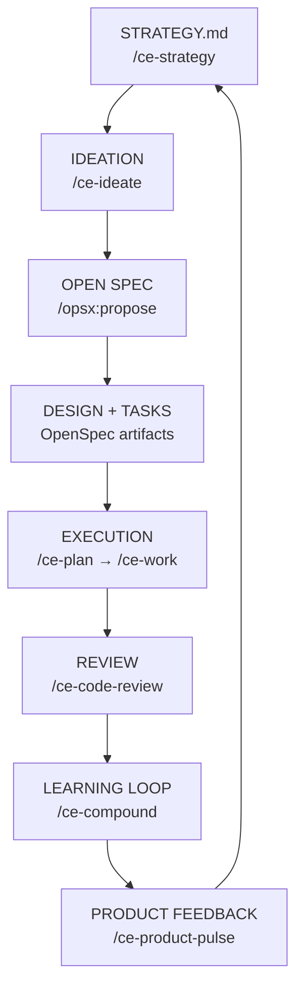

# Engineering System (OpenSpec + Compound Engineering)

An AI-assisted engineering lifecycle for structured feature development:

> Strategy → Ideation → Specification → Execution → Learning → Feedback

**New to the system? Start here: [docs/onboarding.md](docs/onboarding.md)**  
**How to interact with Claude at each phase: [docs/ai-lifecycle.md](docs/ai-lifecycle.md)**

---

## How It Works

Two tools work together:

| Tool | Role |
|---|---|
| **OpenSpec** | Turns ideas into structured artifacts — proposal, design, tasks — before code is written |
| **Compound Engineering** | Drives execution, review, and learning through Claude Code commands |

---

## Requirements

- Node.js ≥ 20.19.0
- Claude Code

---

## Setup

### 1. Install OpenSpec

```bash
npm install -g @fission-ai/openspec@latest
```

### 2. Initialize OpenSpec in your project

```bash
cd your-project
openspec init
```

This creates a `.opsx/` config directory.

### 3. Install Compound Engineering in Claude Code

Open Claude Code in your project directory and run:

```
/plugin marketplace add EveryInc/compound-engineering-plugin
/plugin install compound-engineering
/ce-setup
```

---

## Workflow

Not every change needs the same process. Choose a tier:

| Tier | When | Commands |
|---|---|---|
| **Hotfix** | Bug, typo, config change | `/ce-debug` → `/ce-code-review` |
| **Standard Feature** | Clear scope, < 1 week | `/opsx:propose` → `/ce-plan` → `/ce-work` → `/ce-code-review` → `/ce-compound` |
| **Major Feature** | Architecture change, cross-team, > 1 week | Full cycle below |

### Full cycle (Major Feature)

```
/ce-strategy      → defines direction, users, metrics → STRATEGY.md
/ce-ideate        → explores solutions, recommends one
/opsx:propose     → creates proposal.md, design.md, tasks.md
/opsx:apply       → applies spec into project structure
/ce-plan          → builds execution plan
/ce-work          → implements task by task
/ce-code-review   → reviews against spec
/ce-compound      → captures learnings
/ce-product-pulse → captures post-ship feedback
```



---

## Rules

- No code without `tasks.md`
- No shipping without `/ce-code-review`
- No closing a feature without `/ce-compound`
- Match the tier to the task — don't run `/ce-strategy` on a bug fix

---

## Templates

| Template | Use for |
|---|---|
| [`templates/STRATEGY.md`](templates/STRATEGY.md) | Defining product direction (Tier 3) |
| [`templates/proposal.md`](templates/proposal.md) | Feature proposal artifact |
| [`templates/design.md`](templates/design.md) | Technical design artifact |
| [`templates/tasks.md`](templates/tasks.md) | Implementation checklist artifact |
