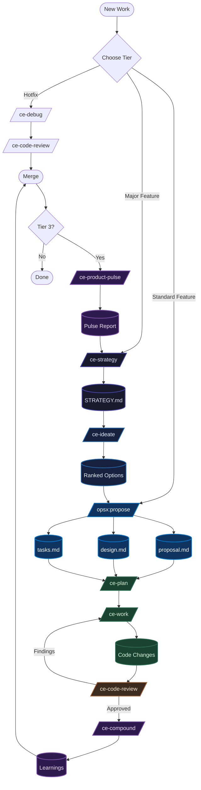
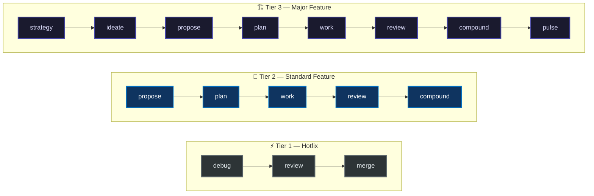
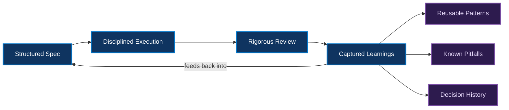
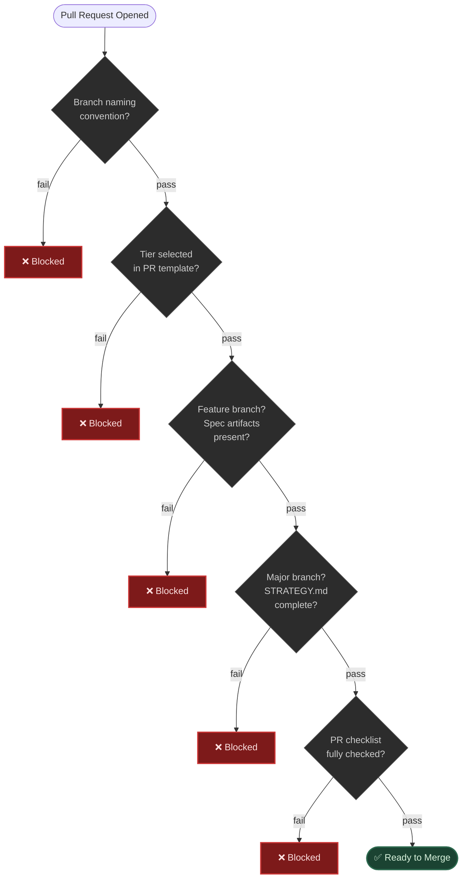

# Engineering System — Executive Diagram

## The Full Lifecycle

```mermaid
flowchart TD
    classDef strategy fill:#1a1a2e,color:#e0e0ff,stroke:#4444aa,stroke-width:2px
    classDef ideation fill:#16213e,color:#e0f0ff,stroke:#2266aa,stroke-width:2px
    classDef spec fill:#0f3460,color:#ffffff,stroke:#0077cc,stroke-width:2px
    classDef execution fill:#1b4332,color:#d8f3dc,stroke:#2d6a4f,stroke-width:2px
    classDef review fill:#3d2b1f,color:#ffe8d6,stroke:#a05c34,stroke-width:2px
    classDef learning fill:#2d1b4e,color:#ede0ff,stroke:#7b4ea6,stroke-width:2px
    classDef artifact fill:#1c1c1c,color:#cccccc,stroke:#555555,stroke-width:1px,stroke-dasharray:4

    %% Entry: Tier Decision
    START([New Work]) --> TIER{Choose Tier}

    TIER -->|Hotfix| T1_DEBUG[/ce-debug/]
    TIER -->|Standard Feature| T2_PROPOSE
    TIER -->|Major Feature| T3_STRATEGY

    %% Tier 1 fast path
    T1_DEBUG --> T1_REVIEW[/ce-code-review/]
    T1_REVIEW --> MERGE([Merge])

    %% Tier 3: Strategy + Ideation
    T3_STRATEGY[/ce-strategy/] --> STRAT_FILE[(STRATEGY.md)]
    STRAT_FILE --> T3_IDEATE[/ce-ideate/]
    T3_IDEATE --> RANKED[(Ranked Options)]
    RANKED --> T2_PROPOSE

    %% Tier 2+: Spec
    T2_PROPOSE[/opsx:propose/] --> PROPOSAL[(proposal.md)]
    T2_PROPOSE --> DESIGN[(design.md)]
    T2_PROPOSE --> TASKS[(tasks.md)]

    %% Execution
    PROPOSAL --> PLAN[/ce-plan/]
    DESIGN --> PLAN
    TASKS --> PLAN
    PLAN --> WORK[/ce-work/]
    WORK --> CODE[(Code Changes)]

    %% Review
    CODE --> REVIEW[/ce-code-review/]
    REVIEW -->|Findings| WORK
    REVIEW -->|Approved| COMPOUND[/ce-compound/]

    %% Learning loop
    COMPOUND --> LEARNINGS[(Learnings)]
    LEARNINGS --> MERGE

    %% Feedback (Tier 3)
    MERGE --> PULSE{Tier 3?}
    PULSE -->|Yes| PRODUCT_PULSE[/ce-product-pulse/]
    PULSE -->|No| DONE([Done])
    PRODUCT_PULSE --> PULSE_REPORT[(Pulse Report)]
    PULSE_REPORT --> T3_STRATEGY

    %% Styling
    class T3_STRATEGY,STRAT_FILE strategy
    class T3_IDEATE,RANKED ideation
    class T2_PROPOSE,PROPOSAL,DESIGN,TASKS spec
    class PLAN,WORK,CODE execution
    class REVIEW review
    class COMPOUND,LEARNINGS,PRODUCT_PULSE,PULSE_REPORT learning
```

---

## Three Tiers at a Glance

```mermaid
flowchart LR
    classDef t1 fill:#2d3436,color:#dfe6e9,stroke:#636e72,stroke-width:2px
    classDef t2 fill:#0f3460,color:#ffffff,stroke:#0077cc,stroke-width:2px
    classDef t3 fill:#1a1a2e,color:#e0e0ff,stroke:#4444aa,stroke-width:2px

    subgraph T1["⚡ Tier 1 — Hotfix"]
        direction LR
        A1[debug] --> A2[review] --> A3[merge]
    end

    subgraph T2["🔧 Tier 2 — Standard Feature"]
        direction LR
        B1[propose] --> B2[plan] --> B3[work] --> B4[review] --> B5[compound]
    end

    subgraph T3["🏗️ Tier 3 — Major Feature"]
        direction LR
        C1[strategy] --> C2[ideate] --> C3[propose] --> C4[plan] --> C5[work] --> C6[review] --> C7[compound] --> C8[pulse]
    end

    class A1,A2,A3 t1
    class B1,B2,B3,B4,B5 t2
    class C1,C2,C3,C4,C5,C6,C7,C8 t3
```

---

## The Compounding Knowledge Loop

```mermaid
flowchart LR
    classDef core fill:#0f3460,color:#ffffff,stroke:#0077cc,stroke-width:2px
    classDef compound fill:#2d1b4e,color:#ede0ff,stroke:#7b4ea6,stroke-width:2px
    classDef output fill:#1b4332,color:#d8f3dc,stroke:#2d6a4f,stroke-width:2px

    SPEC[Structured Spec] --> EXEC[Disciplined Execution]
    EXEC --> REVIEW[Rigorous Review]
    REVIEW --> LEARN[Captured Learnings]
    LEARN -->|feeds back into| SPEC

    LEARN --> PATTERNS[Reusable Patterns]
    LEARN --> ANTIPATTERNS[Known Pitfalls]
    LEARN --> DECISIONS[Decision History]

    class SPEC,EXEC,REVIEW,LEARN core
    class PATTERNS,ANTIPATTERNS,DECISIONS compound
```

---

## CI Enforcement Gates

```mermaid
flowchart TD
    classDef gate fill:#7d1a1a,color:#ffe0e0,stroke:#cc3333,stroke-width:2px
    classDef pass fill:#1b4332,color:#d8f3dc,stroke:#2d6a4f,stroke-width:2px
    classDef check fill:#2c2c2c,color:#cccccc,stroke:#555,stroke-width:1px

    PR([Pull Request Opened]) --> G1

    G1{Branch naming\nconvention?} -->|fail| BLOCK1[❌ Blocked]
    G1 -->|pass| G2

    G2{Tier selected\nin PR template?} -->|fail| BLOCK2[❌ Blocked]
    G2 -->|pass| G3

    G3{Feature branch?\nSpec artifacts\npresent?} -->|fail| BLOCK3[❌ Blocked]
    G3 -->|pass| G4

    G4{Major branch?\nSTRATEGY.md\ncomplete?} -->|fail| BLOCK4[❌ Blocked]
    G4 -->|pass| G5

    G5{PR checklist\nfully checked?} -->|fail| BLOCK5[❌ Blocked]
    G5 -->|pass| READY([✅ Ready to Merge])

    class G1,G2,G3,G4,G5 check
    class BLOCK1,BLOCK2,BLOCK3,BLOCK4,BLOCK5 gate
    class READY pass
```
